# miniRT Parsing Flow Chart

## Main Parsing Flow

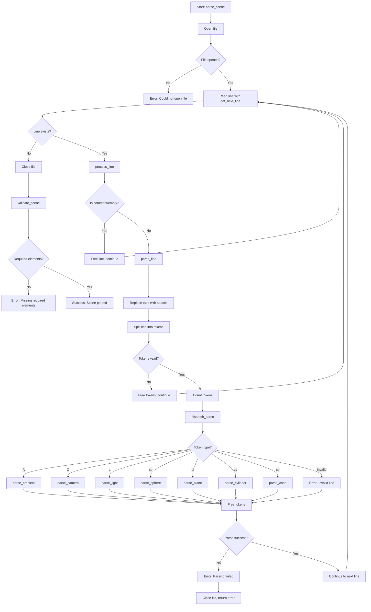

## Scene Elements Parsing Flow

### Ambient Light Parsing
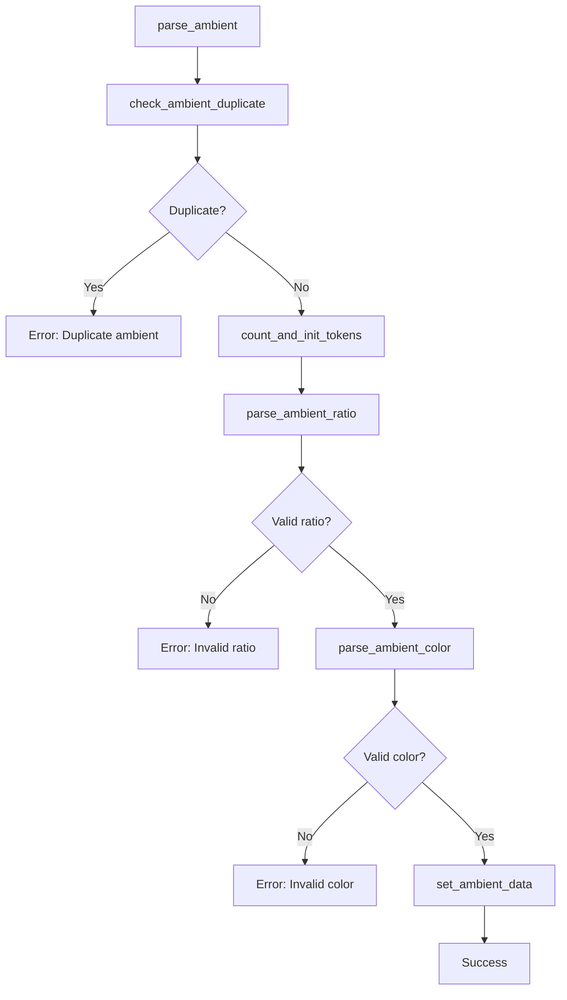

### Camera Parsing
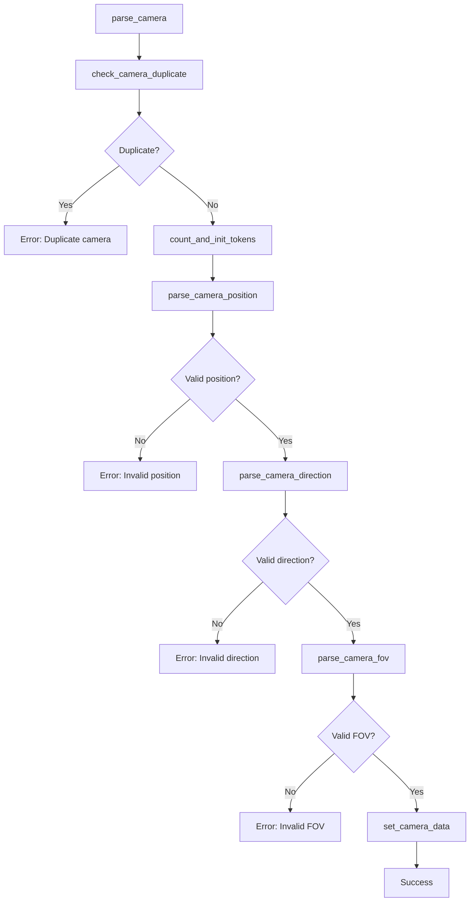

### Light Parsing
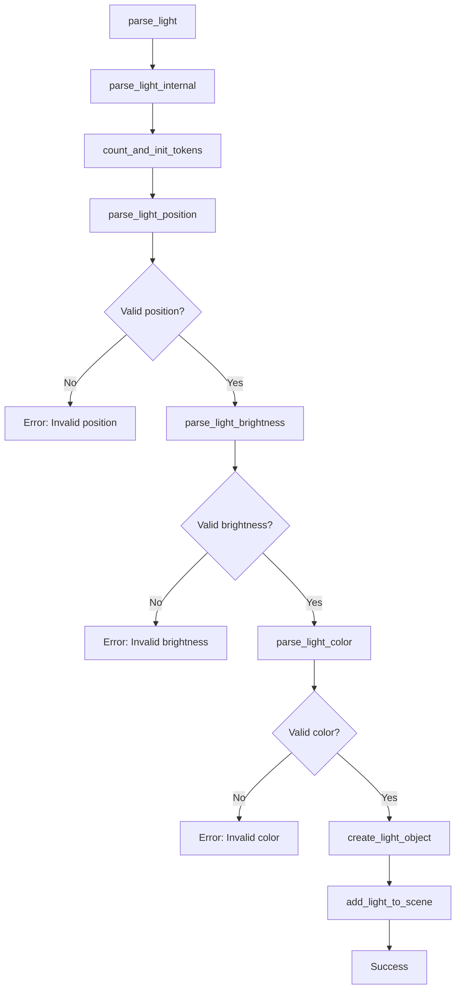

## Primitive Objects Parsing Flow

### Sphere Parsing
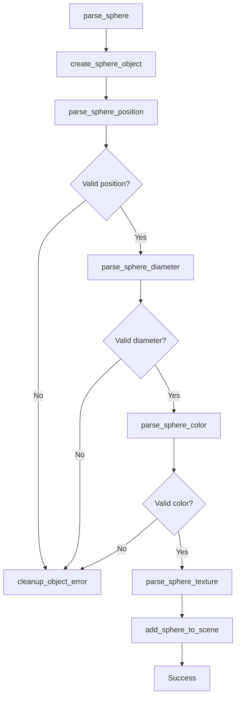

### Plane Parsing
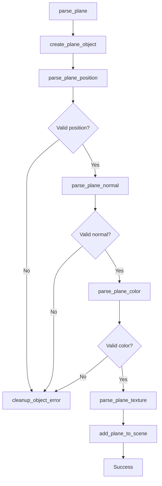

### Cylinder Parsing
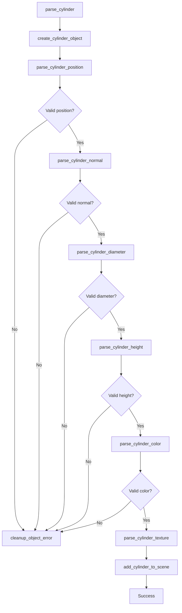

### Cone Parsing
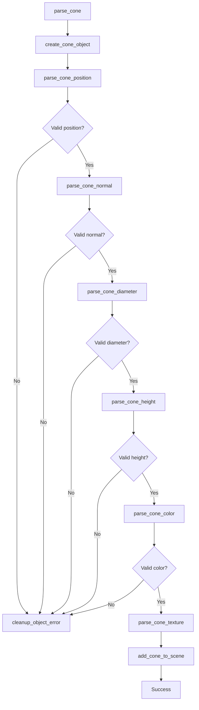

## Token Parsing Flow

### Vector Parsing
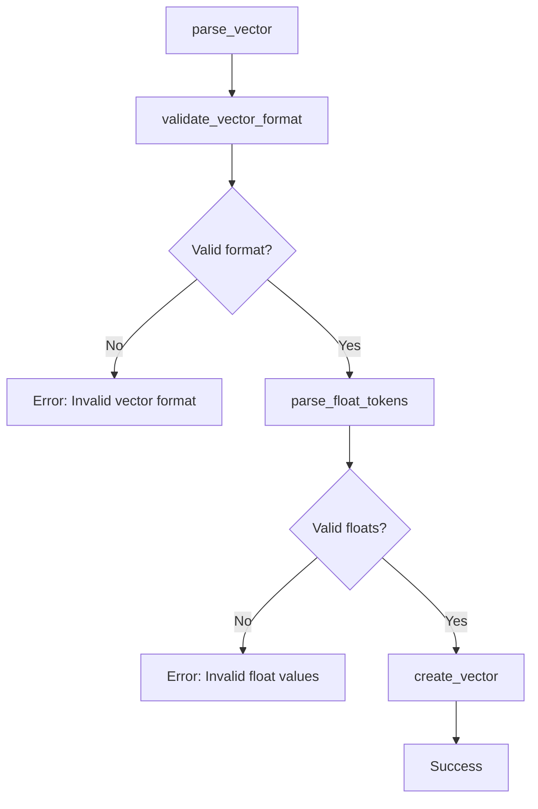

### Color Parsing
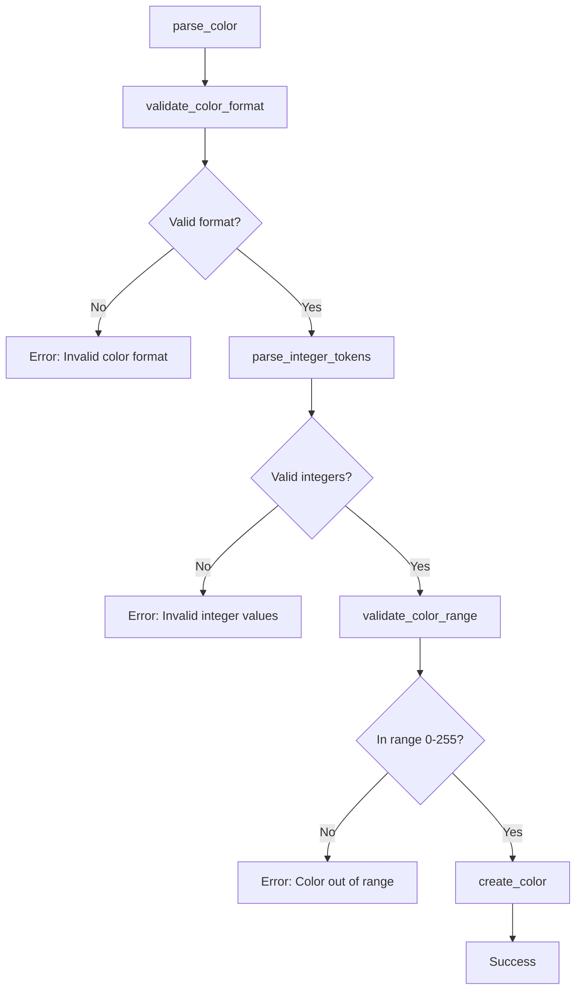

### Float Parsing
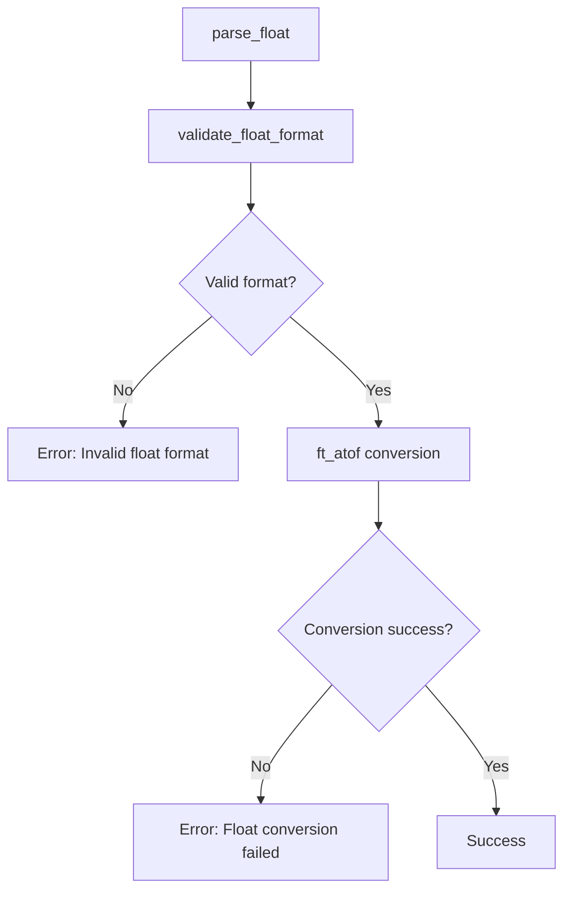

## File Structure and Function Locations

### Main Parser Files:
1. `srcs/parsing/parser.c` - Main parsing entry point
2. `srcs/parsing/scene/parse_scene_elements.c` - Scene elements (A, C, L)
3. `srcs/parsing/primitives/parse_primitives.c` - Primitive objects (sp, pl, cy, co)
4. `srcs/parsing/tokens/parse_tokens.c` - Token parsing utilities
5. `srcs/parsing/vectors/parse_vector.c` - Vector parsing
6. `srcs/parsing/colors/parse_color.c` - Color parsing

### Key Functions by File:
- **parser.c**: `parse_scene()`, `parse_line()`, `dispatch_parse()`
- **parse_scene_elements.c**: `parse_ambient()`, `parse_camera()`, `parse_light()`
- **parse_primitives.c**: `parse_sphere()`, `parse_plane()`, `parse_cylinder()`, `parse_cone()`
- **parse_tokens.c**: `parse_float()`, `parse_integer()`
- **parse_vector.c**: `parse_vector()`
- **parse_color.c**: `parse_color()`

## Error Handling Flow

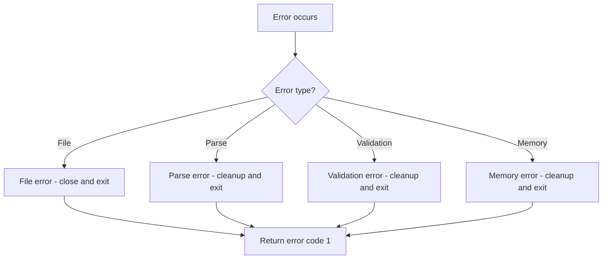

## Success Flow

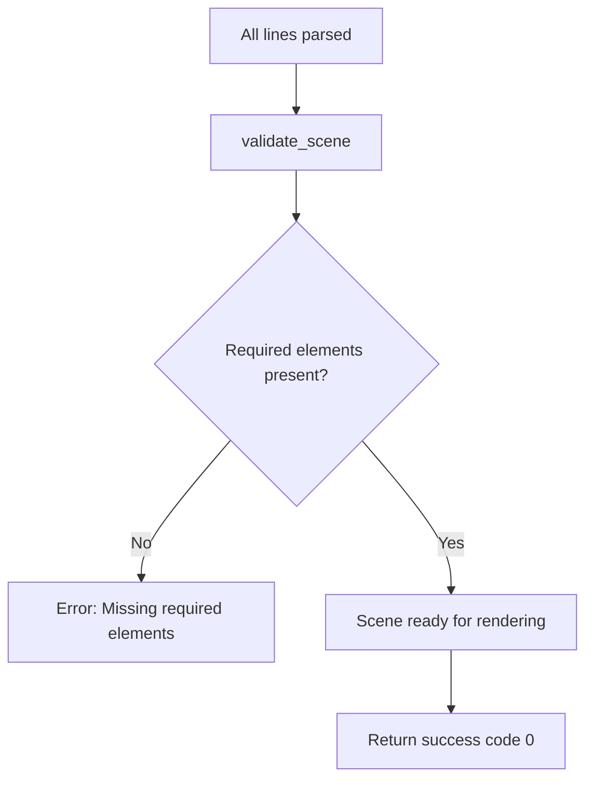

This flow chart shows the complete parsing pipeline from file opening to scene validation, including all the different object types and their specific parsing requirements.
